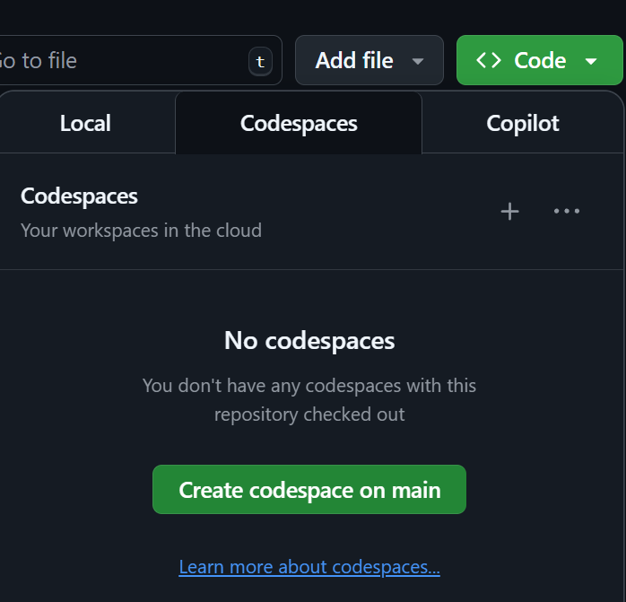
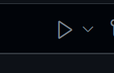

# SkarpC – kode på nynorsk!

SkarpC er eit nynorsk alternativ til C#, som gjer det mogleg å overhalde framtidige krav i mållova om ein viss del nynorsk i leveransar til det offentlege.

Verktøykassa vår for SkarpC består av to konsollapplikasjonar som blir brukte for å omsetje frå høvesvis C# til SkarpC og frå SkarpC til C#.
- csharp_to_skarpc
- skarpc_to_csharp

Bygg desse to prosjekta, så kan du køyre dei frå kommandolinja med full sti til prosjektet som skal omsetjast som første og einaste parameter

Døme med demo-prosjektet:
- Bygg prosjektet «03 SkarpCTilCSharp»
- `cd \SkarpC\SkarpCTilCSharp\bin\Release\net9.0\`
- `skarpc_to_csharp \SkarpC\Demo`
- Brått så har du i tillegg til .sc-filene i Demo-prosjektet òg .cs-filer du kan kompilere

## Verktøystøtte
- [Syntaks-utheving for Visual Studio Code](https://github.com/tomahg/SkarpC/tree/main/VsCodeSyntaxHighligtingExtension)

# Utviklarhaldar

Benytt utviklarhaldar til å utforske i koderom.

Opne eit GjevNav koderom:


Gjer vel og køyr fylgjande i kommandolinja

```yaml
dotnet build SkarpCTilCSharp/

SkarpCTilCSharp/bin/Debug/net9.0/skarpc_to_csharp Demo
```

Om du likar påskenete, kanskje legg koden din i `Demo/Program.sc` fysst.

Til slutt, opne `Demo\Program.cs` og trykk på spel knappen.
